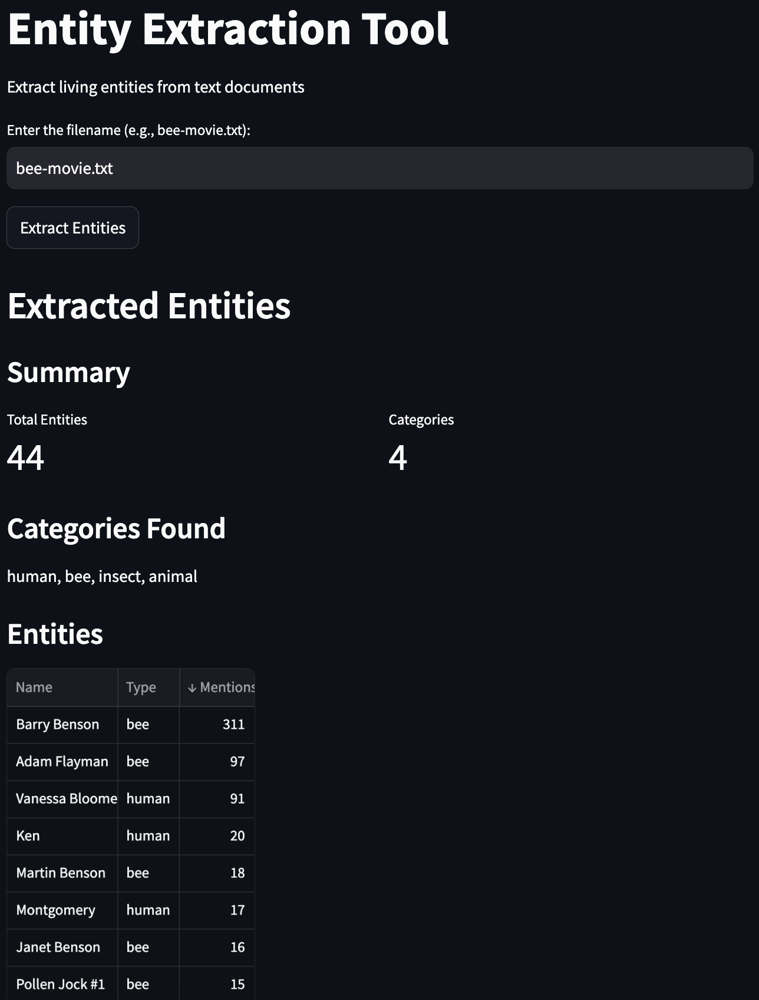

# Entity Extraction Tool

Extract living entities from text documents using LLMs.

## Demo

## Features
- Extract and categorize living entities from text documents
- Structured JSON output with entity types and mention counts
- Simple Streamlit frontend for easy interaction
- Django REST API backend
- OpenAI GPT integration

## Setup and Usage
[Your existing setup instructions here]

Concept extraction, knowledge graph management, and ontologies.

